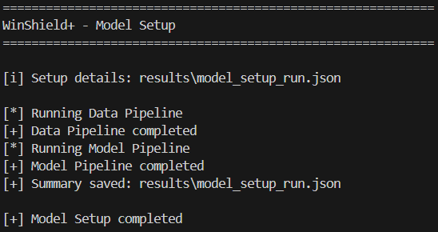
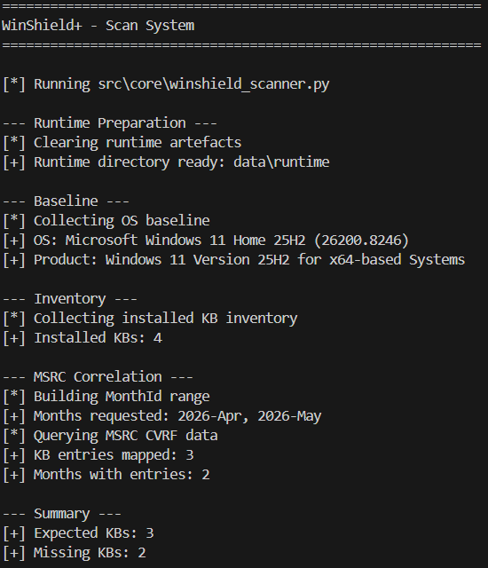
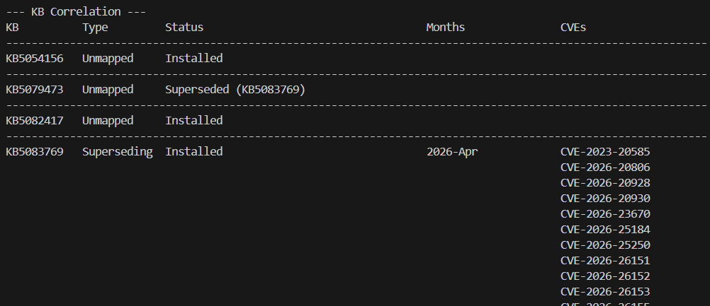
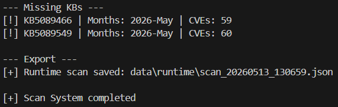
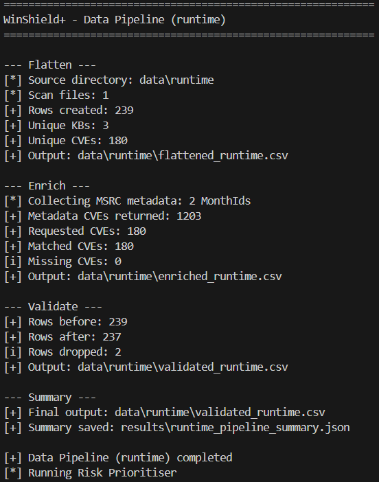
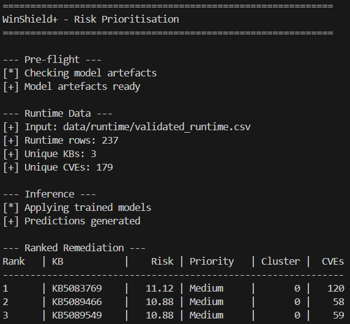
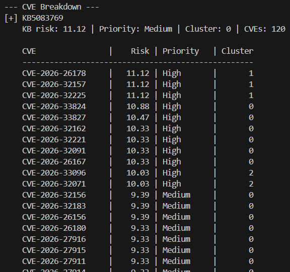

# WinShield+

**Windows patch risk prioritisation workflow using PowerShell, Python, MSRC advisory data, and machine learning.**

WinShield+ scans a Windows host, maps missing KB updates to the CVEs they remediate, enriches those CVEs with Microsoft Security Response Center metadata, and ranks the missing updates by predicted remediation risk.

The project is built as a controlled lab and portfolio tool for Windows patch-state analysis, vulnerability triage, and remediation planning. It is not a replacement for enterprise patch management, but it demonstrates how raw Windows update data can be turned into structured, reviewable security intelligence.

## Why It Exists

A missing Windows update is not automatically meaningful on its own. The operational question is what that missing update exposes the system to.

WinShield+ answers that by connecting four layers that are usually viewed separately:

1. The host's Windows baseline and installed KB inventory.
2. Microsoft advisory data for the relevant Windows product and security update months.
3. CVE metadata such as CVSS score, exploitation status, attack vector, severity, and patch age.
4. Model-driven prioritisation that ranks missing KBs by the risk profile of their linked CVEs.

The result is a workflow that moves from "which KBs are missing?" to "which missing updates should be reviewed first, and why?"

## Demo Workflow

The screenshots below show the intended operator flow from setup to runtime scan and ranked remediation output.

### Operator Menu


The project is driven from a single master runner that exposes the main workflow stages: scan, rank risk, download, install, clear artefacts, and model setup.

### Model Setup



Model Setup runs the training data pipeline and model pipeline. The detailed output is written to `results/model_setup_run.json`, keeping the operator menu readable while preserving execution evidence.

### System Scan



The scanner collects host baseline information, installed KB inventory, MSRC CVRF advisory data, and exports a fresh runtime scan.



WinShield+ correlates KBs against advisory data and marks each update as installed, superseded, or missing.



Missing KBs are exported into a timestamped runtime JSON file for downstream prioritisation.

### Risk Prioritisation



Rank Risk runs the runtime data pipeline, enriches CVE rows, validates model-ready inputs, and passes the dataset into the prioritiser.



The prioritiser produces a KB-level remediation order based on the highest predicted CVE risk per missing update.



CVE-level predictions remain visible under each KB so the ranking can be reviewed rather than treated as a black box.

## What It Does

| Area | Implementation |
|---|---|
| Windows baseline collection | Reads OS name, display version, build, architecture, latest cumulative update context, and MSRC month hints |
| Patch inventory | Combines `Get-HotFix` with administrator-only `Get-WindowsPackage` data when available |
| Advisory correlation | Uses MSRC CVRF data to map Windows security update KBs to CVEs and update months |
| Supersedence handling | Distinguishes installed KBs, superseded KBs, and missing KBs |
| CVE enrichment | Pulls CVSS score, severity, publication date, exploitation status, and CVSS vector fields |
| Data pipeline | Builds training and runtime datasets through flatten, enrich, label, and validate stages |
| Machine learning | Trains regression, classification, and clustering models for CVE-level risk analysis |
| Runtime ranking | Aggregates CVE-level predictions back to KB-level remediation targets |
| Operator workflow | Provides a single CLI menu for scanning, ranking, downloading, installation, cleanup, and model setup |
| Evidence output | Saves structured JSON and CSV artefacts for review and repeatability |

## High-Level Architecture

```text
Windows host
   |
   | PowerShell collectors
   v
Baseline + installed KB inventory + MSRC CVRF data
   |
   | Python scanner
   v
Runtime scan JSON
   |
   | Data pipeline
   v
Flattened, enriched, validated CVE rows
   |
   | Trained ML artefacts
   v
CVE-level predictions
   |
   | KB aggregation
   v
Ranked missing updates + CVE breakdown
```

## Repository Structure

```text
winshield_plus/
├── src/
│   ├── core/
│   │   ├── winshield_master.py
│   │   ├── winshield_scanner.py
│   │   ├── winshield_prioritiser.py
│   │   ├── winshield_downloader.py
│   │   └── winshield_installer.py
│   └── powershell/
│       ├── winshield_baseline.ps1
│       ├── winshield_inventory.ps1
│       ├── winshield_adapter.ps1
│       └── winshield_metadata.ps1
├── training/
│   ├── data_pipeline.py
│   ├── model_pipeline.py
│   ├── train_regression.py
│   ├── train_classification.py
│   ├── train_clustering.py
│   └── clear_run.py
├── data/
│   ├── scans/
│   ├── dataset/
│   └── runtime/
├── models/
├── results/
├── downloads/
└── assets/
```

## Core Workflow

Run the master menu:

```bash
python src/core/winshield_master.py
```

| Option | Stage | Purpose |
|---:|---|---|
| 1 | Scan System | Collects a fresh runtime scan from the current Windows host |
| 2 | Rank Risk | Builds runtime data and ranks missing KBs using trained models |
| 3 | Download Update | Resolves and downloads an operator-selected missing update |
| 4 | Install Update | Installs a selected `.msu` or `.cab` package without automatic restart |
| 5 | Clear Artefacts | Removes generated artefacts while preserving source training scans |
| 6 | Model Setup | Runs the training data pipeline and model training pipeline |
| 7 | Exit | Exits the operator menu |

Recommended first run order:

```text
6) Model Setup
1) Scan System
2) Rank Risk
```

Model Setup must be run before Rank Risk because the runtime prioritiser depends on saved model and preprocessor artefacts. Scan System must be run before Rank Risk because runtime ranking depends on a fresh `data/runtime/scan_TIMESTAMP.json` file.

## Data Pipeline

The data pipeline supports separate training and runtime modes.

```bash
python training/data_pipeline.py --mode training
python training/data_pipeline.py --mode runtime
```

| Step | Training mode | Runtime mode |
|---|---|---|
| Flatten | Reads historical scan JSON files from `data/scans/` | Reads the newest scan JSON from `data/runtime/` |
| Enrich | Calls the MSRC metadata collector and adds CVE fields | Calls the MSRC metadata collector and adds CVE fields |
| Label | Creates transparent rule-derived risk scores and priority labels | Skipped because runtime data is for inference |
| Validate | Drops incomplete rows missing required model inputs | Drops incomplete rows missing required model inputs |

Validated rows must contain the required model inputs, including `cvss_score` and `attack_vector`.

## Risk Labelling Logic

Training labels are intentionally transparent. The model is trained against a repeatable risk score rather than hidden judgement.

Base score starts with CVSS, then adds:

- `+2` when MSRC exploitation text contains `Exploited:Yes`.
- `+1` when the CVSS attack vector is network-based.
- `patch_age_days / 60` to reflect exposure duration.

Priority labels are then assigned as:

| Risk score | Priority label |
|---:|---|
| `>= 9` | High |
| `>= 6` | Medium |
| `< 6` | Low |

This makes the supervised target easy to inspect and adjust.

## Machine Learning Pipeline

```bash
python training/model_pipeline.py
```

The model pipeline trains three separate models from `data/dataset/validated_dataset.csv`.

| Model | Purpose |
|---|---|
| `RandomForestRegressor` | Predicts a numerical CVE risk score |
| `LogisticRegression` | Predicts Low, Medium, or High priority labels |
| `KMeans` | Groups similar vulnerability profiles into clusters |

Each model has a saved preprocessor so runtime inference uses the same feature handling as training.

Saved artefacts include:

```text
models/regression_model.joblib
models/regression_preprocessor.joblib
models/classification_model.joblib
models/classification_preprocessor.joblib
models/clustering_model.joblib
models/clustering_preprocessor.joblib
models/clustering_features.joblib
```

## Dataset & Runtime Output

A completed training run produced:

| Metric | Value |
|---|---:|
| Training scan files | 9 |
| Flattened training rows | 3,094 |
| Validated training rows | 3,075 |
| Unique training KBs | 38 |
| Unique training CVEs | 1,565 |
| Unique MSRC months | 34 |
| MSRC CVEs returned during enrichment | 9,659 |
| Requested CVEs matched | 1,575 |

A completed runtime scan produced:

| Metric | Value |
|---|---:|
| Runtime scan files | 1 |
| Flattened runtime rows | 239 |
| Validated runtime rows | 237 |
| Unique missing KBs ranked | 3 |
| Unique runtime CVEs | 179 |
| Runtime MSRC months | 2 |

Example ranked remediation output:

| Rank | KB | Max predicted risk | CVEs |
|---:|---|---:|---:|
| 1 | `KB5083769` | 11.12 | 120 |
| 2 | `KB5089549` | 10.88 | 59 |
| 3 | `KB5077961` | 8.49 | 58 |

The full ranking is exported to:

```text
results/ranking_results.json
```

## Output Artefacts

| Artefact | Purpose |
|---|---|
| `data/runtime/scan_TIMESTAMP.json` | Fresh runtime scan exported by Scan System |
| `data/runtime/flattened_runtime.csv` | Runtime KB, CVE, and month relationships |
| `data/runtime/enriched_runtime.csv` | Runtime rows enriched with MSRC metadata |
| `data/runtime/validated_runtime.csv` | Runtime model-ready rows |
| `data/dataset/validated_dataset.csv` | Training dataset used by the model pipeline |
| `models/*.joblib` | Trained model and preprocessor artefacts |
| `results/model_setup_run.json` | Model Setup execution record |
| `results/training_pipeline_summary.json` | Training data pipeline summary |
| `results/runtime_pipeline_summary.json` | Runtime data pipeline summary |
| `results/model_pipeline_summary.json` | Model training and artefact summary |
| `results/ranking_results.json` | KB-level and CVE-level prioritisation output |
| `results/clustering_elbow_curve.png` | KMeans elbow analysis chart |
| `results/clustering_scatter.png` | CVSS score against risk score cluster visualisation |

## Requirements

WinShield+ is designed for Windows lab environments.

| Requirement | Notes |
|---|---|
| Windows 10 or Windows 11 | Required for Windows update inventory and servicing tools |
| PowerShell | Used by the baseline, inventory, adapter, and metadata collectors |
| Python 3.10 or later | Used by the scanner, pipeline, models, and operator workflow |
| MsrcSecurityUpdates PowerShell module | Used to query Microsoft Security Response Center CVRF data |
| Administrator shell | Recommended for richer package inventory and required for installation |

Install the MSRC PowerShell module:

```powershell
Install-Module MsrcSecurityUpdates -Scope CurrentUser
```

Install Python dependencies:

```bash
pip install pandas numpy scikit-learn joblib requests beautifulsoup4 matplotlib
```

## Main Components

### `winshield_master.py`

Provides the operator menu and orchestrates scan, prioritisation, download, install, cleanup, and model setup stages.

### `winshield_scanner.py`

Runs PowerShell collectors, correlates installed Windows updates with MSRC CVRF data, resolves supersedence relationships, and exports a runtime scan.

### `winshield_prioritiser.py`

Loads validated runtime data, applies trained regression, classification, and clustering models, ranks missing KBs, prints CVE-level breakdowns, and exports structured results.

### `winshield_downloader.py`

Uses the latest runtime scan and host baseline constraints to resolve Microsoft Update Catalog candidates for an operator-selected missing KB.

### `winshield_installer.py`

Installs a selected `.msu` package through WUSA or `.cab` package through DISM. It checks for administrative privileges and does not restart the system automatically.

### PowerShell Collectors

| Script | Purpose |
|---|---|
| `winshield_baseline.ps1` | Collects OS identity, build, architecture, LCU context, and MSRC month hints |
| `winshield_inventory.ps1` | Collects installed KBs from `Get-HotFix` and `Get-WindowsPackage` where available |
| `winshield_adapter.ps1` | Queries MSRC CVRF data for the target Windows product and months |
| `winshield_metadata.ps1` | Retrieves CVE severity, CVSS, publication, vector, and exploitation metadata |

## Skills Demonstrated

| Area | Evidence |
|---|---|
| Windows support | Patch inventory, KB state handling, WUSA and DISM servicing workflow |
| Vulnerability management | KB to CVE mapping, MSRC enrichment, missing update prioritisation |
| Security operations | Risk triage, exploitation-aware ranking, structured remediation output |
| PowerShell scripting | Host baseline collection, update inventory, MSRC module automation |
| Python engineering | Modular CLI tooling, JSON and CSV processing, subprocess orchestration |
| Machine learning | Regression, classification, clustering, preprocessing pipelines, saved artefacts |
| Data validation | Training/runtime parity, required field checks, repeatable pipeline summaries |
| Documentation | Screenshot-backed workflow, operator instructions, limitations, evidence artefacts |

## Limitations

WinShield+ is a lab and portfolio tool, not a production patch management platform.

The installer stage depends on Windows servicing behaviour. Updates may fail, roll back, require a restart, or be blocked by host state, supersedence, edition, architecture, or servicing stack conditions.

The machine learning labels are rule-derived rather than business-ground-truth labels. They are useful for demonstrating repeatable prioritisation logic, but they should support operator judgement rather than replace it.

MSRC advisory structures can vary by month, product, and vulnerability format. The project includes filtering and validation, but advisory data should still be reviewed before making real remediation decisions.

Generated artefacts such as `data/dataset/`, `data/runtime/`, `results/`, `models/`, and `downloads/` are intentionally ignored by Git so the repository can stay focused on source code and reproducible workflow logic.

## Project Status

WinShield+ currently demonstrates an end-to-end patch intelligence workflow:

```text
scan host -> map KBs to CVEs -> enrich CVEs -> validate data -> train models -> rank missing updates
```

The strongest part of the project is the full pipeline design: Windows collection, advisory correlation, structured data engineering, model training, runtime inference, and explainable KB-level remediation output.
