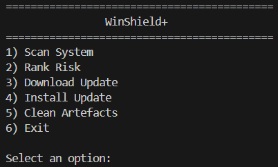
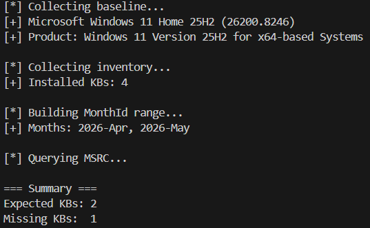
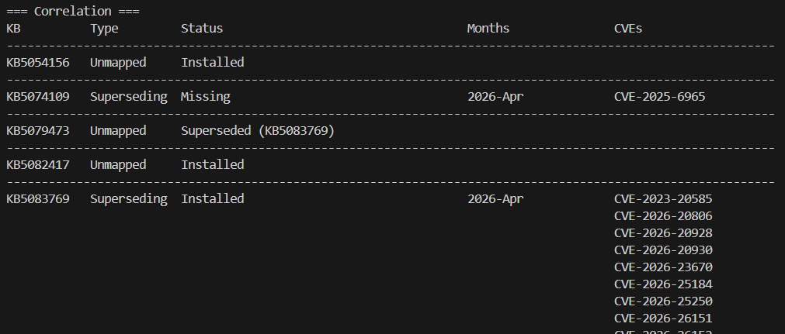
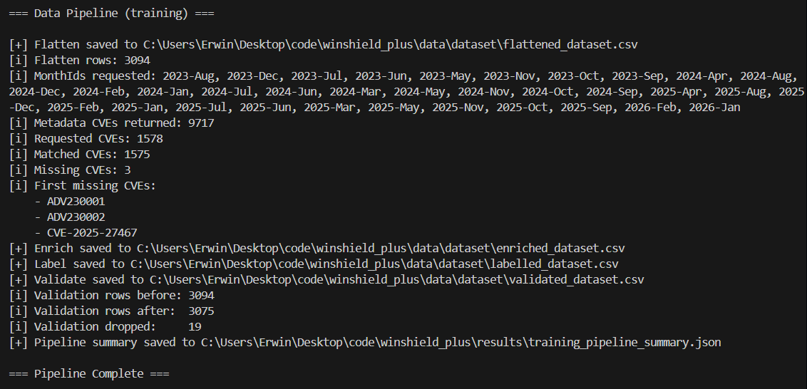
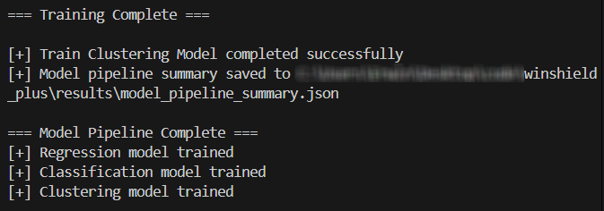
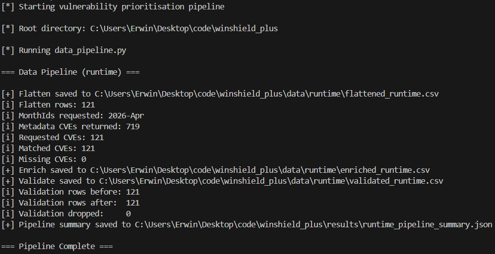
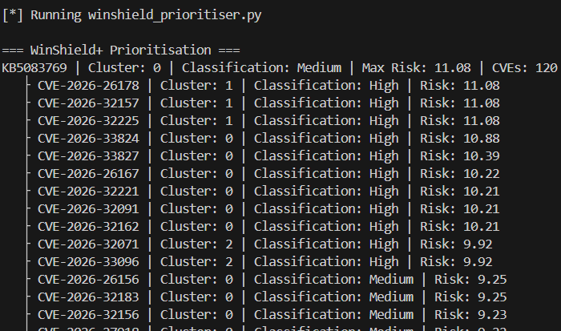
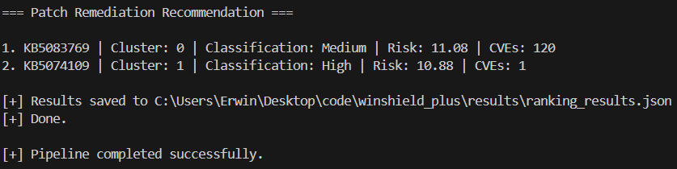

# WinShield+

**Windows patch-state exposure discovery and risk-based remediation ranking.**

WinShield+ scans a Windows host, identifies missing KB updates, exposes the CVEs tied to those missing patches, enriches the vulnerability data with MSRC metadata, and ranks remediation priority using a transparent machine learning pipeline.

It is designed for controlled lab and portfolio use. It is not a replacement for Windows Update, WSUS, Intune, SCCM, or enterprise patch management.

## Problem

Windows Update can tell a machine how to stay current. It does not give an analyst a clean explanation of the attack surface left behind by missing patches.

That creates a practical triage problem:

```text
Missing KBs -> many CVEs -> mixed severity -> unclear remediation order
```

WinShield+ focuses on that gap. The important output is not only that a patch is missing. The important output is which CVEs are exposed because that patch is missing, how those CVEs compare, and which KB should be reviewed first.

## Solution

WinShield+ turns local patch state into a ranked vulnerability management workflow.

```text
Harvest Host Data -> Build Scan JSON -> Enrich CVEs -> Train Models -> Scan Runtime Host -> Rank Missing KBs
```

The scanner discovers patch-state exposure. The data pipeline turns nested scan output into model-ready rows. The prioritiser scores CVEs and aggregates them back to the KB level, because Windows remediation happens through updates, not isolated CVE fixes.

## Skills Presented

| Area | Demonstrated Through |
|---|---|
| Windows administration | KB inventory, cumulative update handling, PowerShell collection, admin-aware scanning |
| Vulnerability management | CVE mapping, MSRC advisory correlation, missing patch exposure analysis |
| Security operations | Prioritised remediation output, evidence-based triage, analyst-readable results |
| Data engineering | JSON artefacts, CSV datasets, flattening, enrichment, validation, reproducible stages |
| Machine learning | Regression, classification, clustering, saved model artefacts, runtime inference |
| Secure coding approach | Modular boundaries, explicit execution paths, validation before modelling, operator-controlled remediation |

## Screenshots

### Operator Menu



The main entry point keeps the workflow explicit. The operator chooses when to scan, rank risk, run model setup, download packages, install packages, or clear generated artefacts.

### Update Collection



The scanner collects host baseline data, installed KBs, MSRC MonthIds, expected advisories, and missing update counts. This is the first stage where local patch state becomes security-relevant evidence.

### KB And CVE Correlation



The correlation table shows how expected KBs, installed state, supersedence, MonthIds, and CVE counts connect. This is where WinShield+ exposes attack surface rather than only listing update history.

### Training Data Pipeline



The training pipeline converts scan JSON into a dataset by flattening KB/CVE relationships, enriching CVEs with MSRC metadata, labelling rows, and validating required model fields.

### Model Training



The model setup trains regression, classification, and clustering models, then saves reusable artefacts under `models/` for runtime ranking.

### Runtime Pipeline



Runtime scans use the same transformation logic as training. This keeps feature structure aligned and avoids a common ML failure point where training data and live data drift apart.

### Prioritisation Table



The prioritiser ranks missing KBs by the highest predicted CVE risk attached to each update. A single high-risk CVE can push an entire KB higher in the remediation order.

### Remediation Summary



The final output gives a short remediation order for the operator, while the full JSON result preserves the detailed CVE-level breakdown.

## Architecture

```text
src/powershell/
  winshield_baseline.ps1     -> OS baseline, build, architecture, LCU context, MSRC product hint
  winshield_inventory.ps1    -> installed KB collection through Get-HotFix and Get-WindowsPackage
  winshield_adapter.ps1      -> MSRC CVRF advisory collection and KB/CVE mapping
  winshield_metadata.ps1     -> CVSS, severity, exploit, vector, and publication metadata

src/core/
  winshield_master.py        -> operator menu and orchestration
  winshield_scanner.py       -> scan, correlate, classify patch state
  winshield_prioritiser.py   -> load models and rank missing KBs
  winshield_downloader.py    -> optional Microsoft Update Catalog package download
  winshield_installer.py     -> optional WUSA/DISM package installation

training/
  data_pipeline.py           -> flatten, enrich, label, validate
  model_pipeline.py          -> train regression, classification, clustering
```

The project is intentionally split into collection, processing, modelling, and optional remediation. Each layer has a defined role and writes structured artefacts that can be reviewed independently.

## How It Works

WinShield+ uses three complementary approaches to solve the same problem: turning missing patches into useful security decisions.

| Approach | Why It Exists | Implementation |
|---|---|---|
| Exposure discovery | Find the real attack surface created by missing updates | Map missing KBs to CVEs through MSRC advisory data and supersedence-aware scan logic |
| Data preparation | Make raw scan output safe for modelling | Flatten nested JSON, enrich CVEs, parse CVSS vectors, remove incomplete rows |
| Risk prioritisation | Decide what should be reviewed first | Predict CVE risk, assign priority labels, group similar vulnerabilities, then aggregate results by KB |

This keeps the project grounded. The scanner does not pretend every CVE is exploitable. It exposes patch-linked vulnerability coverage, then provides a repeatable way to prioritise review.

## Risk Logic

The supervised training labels are intentionally transparent. The model learns a defined policy rather than inventing hidden rules.

```text
risk_score = cvss_score
           + 2 if Exploited:Yes
           + 1 if attack_vector is Network
           + patch_age_days / 60
```

| Risk Score | Priority |
|---:|---|
| `>= 9` | High |
| `>= 6` | Medium |
| `< 6` | Low |

At runtime, predictions are produced at CVE level and aggregated to KB level. The maximum CVE risk determines the KB ranking because one serious vulnerability can justify urgent remediation.

## Model Layer

| Model | Purpose |
|---|---|
| `RandomForestRegressor` | Produces a continuous CVE risk score |
| `LogisticRegression` | Assigns an interpretable Low, Medium, or High label |
| `KMeans` | Groups vulnerabilities with similar feature patterns |

Latest local training run:

| Metric | Value |
|---|---:|
| Training scan files | 9 |
| Flattened training rows | 3,094 |
| Validated training rows | 3,075 |
| Unique training CVEs | 1,578 |
| Unique training KBs | 38 |
| Runtime validated rows | 121 |
| Runtime matched CVEs | 121 |
| KMeans clusters | 5 |

These metrics should be read honestly. The supervised models are learning a rule-derived policy, so high performance means the pipeline is internally consistent. It does not prove real-world prediction quality against external incident data.

## Example Output

A runtime ranking is written to:

```text
results/ranking_results.json
```

Example ranked KB structure:

```text
KB5083769
  max_risk: 11.08
  classification: Medium
  cluster: 0
  CVE breakdown: individual CVE predictions retained in JSON
```

The goal is to support two views at once: a quick remediation order for triage, and a detailed evidence trail for technical review.

## Security And Governance

WinShield+ is built around controlled execution and reviewable output.

| Control | Implementation |
|---|---|
| Operator control | Download and install actions require explicit menu selection |
| No silent remediation | A scan does not automatically install updates |
| No forced reboot | Installer helpers do not force restart behaviour |
| Auditable artefacts | Scan, pipeline, model, and ranking outputs are saved as JSON or CSV |
| Modular safety | Collection, enrichment, modelling, download, and install logic are separated |
| Data validation | Rows missing critical fields such as `cvss_score` or `attack_vector` are dropped before model use |
| Supply-chain awareness | Dependencies are explicit and should be pinned, scanned, and reviewed before production-style use |

A production-ready version should add pinned dependencies, package hash verification, signed artefacts, dependency scanning, and stronger automated test coverage.

## Risk Reduction Value

WinShield+ supports risk reduction by moving the question from update presence to exposure evidence.

```text
Not just: Which KBs are missing?
Better: Which CVEs are exposed by those missing KBs, and which patch should be reviewed first?
```

That gives an analyst or support engineer a clearer handoff: missing update, linked CVEs, predicted risk, priority label, cluster, and supporting artefacts.

## Quick Start

Run from an elevated Windows PowerShell or terminal.

```powershell
Install-Module MsrcSecurityUpdates -Scope CurrentUser
```

```bash
pip install pandas numpy scikit-learn joblib requests beautifulsoup4 matplotlib
python src/core/winshield_master.py
```

Recommended first run:

```text
6) Model Setup
1) Scan System
2) Rank Risk
```

Model setup must run before ranking because the prioritiser loads saved model and preprocessor artefacts from `models/`.

## Project Status

Current status: **working lab implementation**.

Strongest completed areas:

- Windows patch-state and MSRC correlation
- CVE exposure discovery from missing KBs
- Structured training and runtime data pipelines
- CVE enrichment and validation
- Saved model artefacts
- KB-level remediation ranking
- Operator-controlled optional download/install stages

Planned improvements:

- Add pinned `requirements.txt`
- Add pytest coverage for Python pipeline logic
- Add Pester coverage for PowerShell collectors
- Add hash verification for downloaded packages
- Add pre/post scan diffing for remediation evidence
- Add KEV or threat intelligence context to reduce reliance on CVSS and patch age

## Limitations

WinShield+ reports exposure, not exploitability. A mapped CVE may require local access, user interaction, specific configuration, or a chained attack path that the tool does not validate.

MSRC data is authoritative but not perfectly uniform. Advisory fields, CVSS data, exploitation text, supersedence, and publication timing can vary between months.

The ML layer currently learns from deterministic labels. It is useful for transparent prioritisation and portfolio demonstration, but it should support analyst judgement rather than replace it.

The installer stage is conservative by design. Windows servicing may reject, supersede, defer, or roll back individual packages depending on host state.

## Licence

MIT License. See `LICENSE`.
