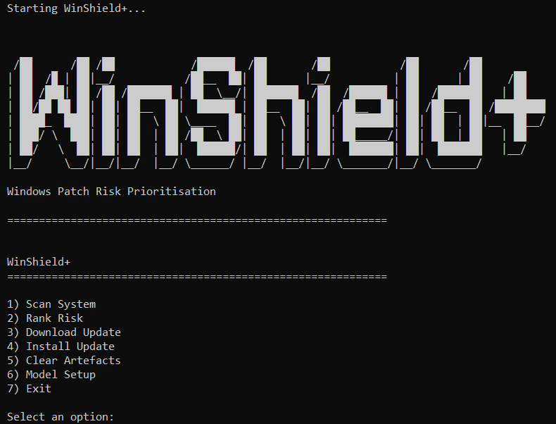
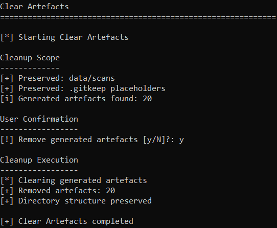
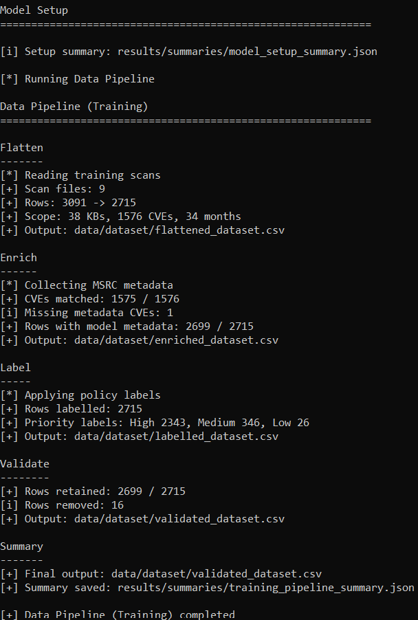
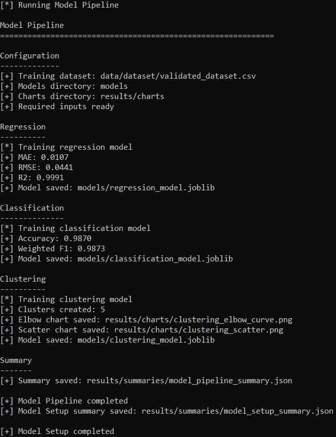
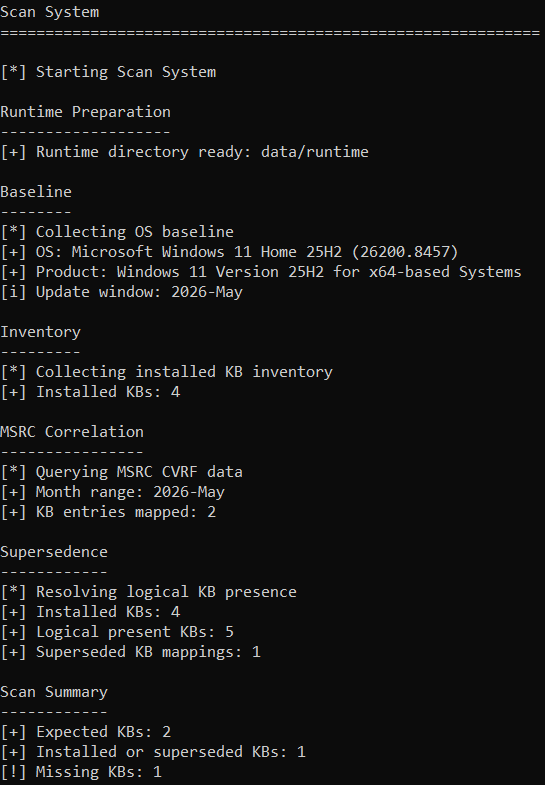
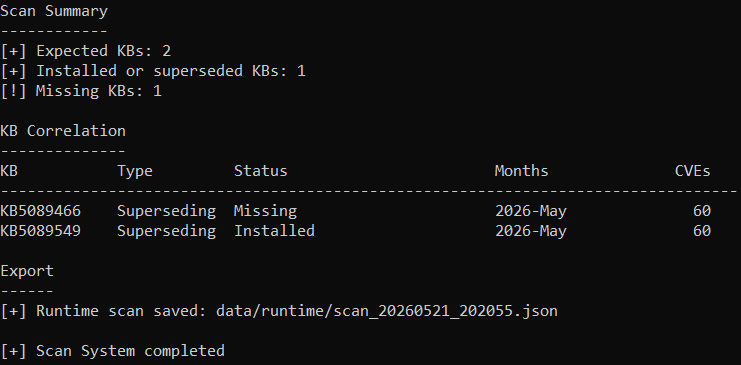
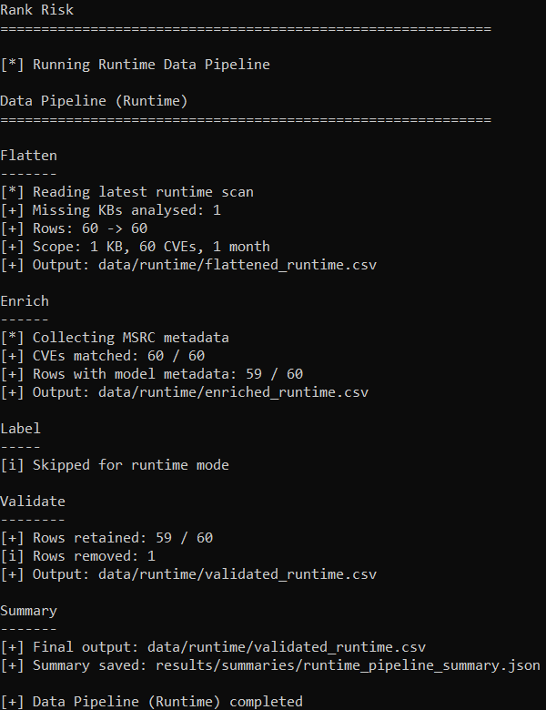
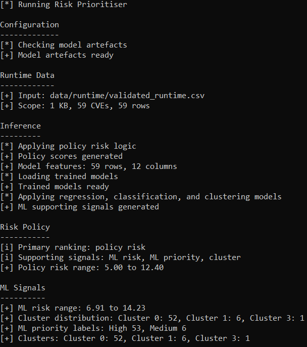
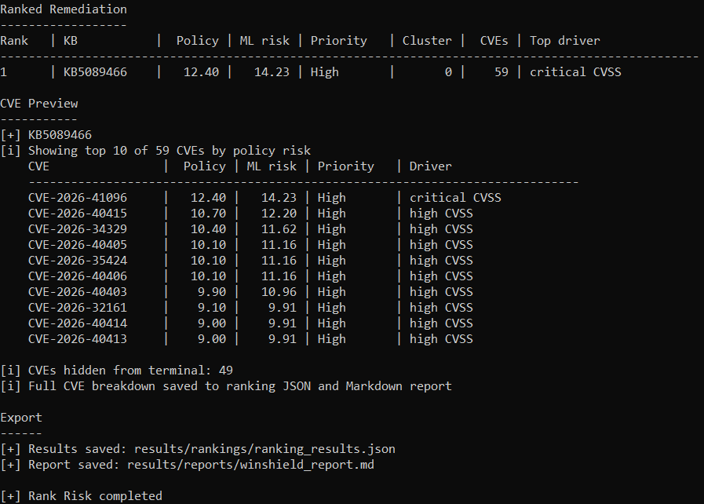
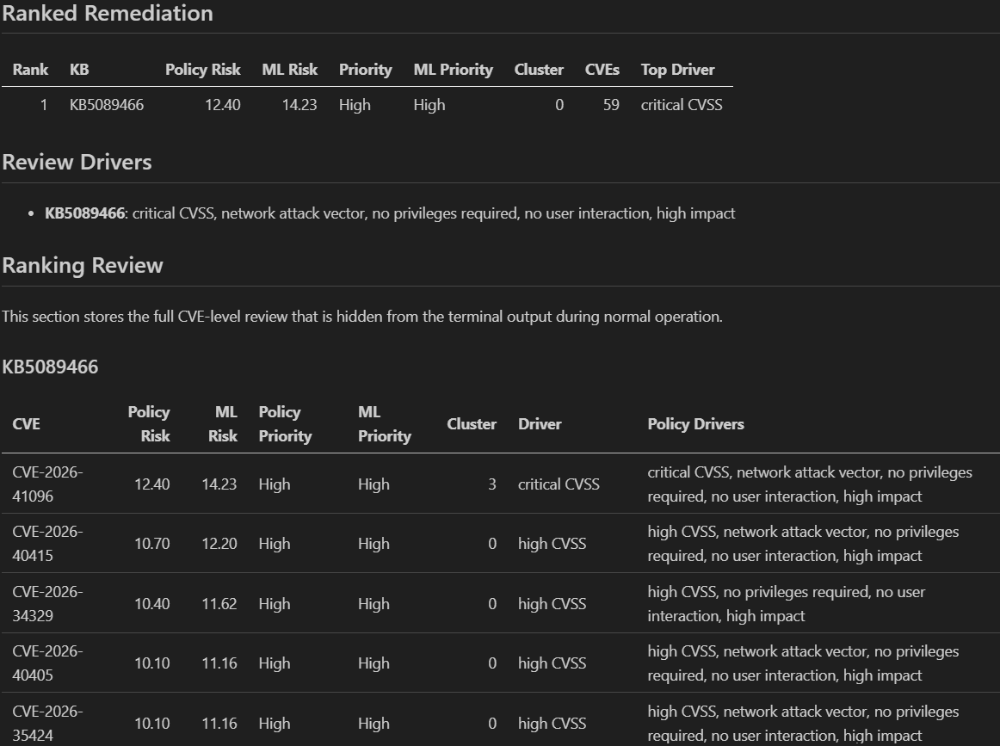

# WinShield+

**Turns Windows patch state into missing-KB evidence, CVE enrichment, and explainable risk prioritisation.**

[Companion Project: WinShield+ Collector](https://github.com/erwinmagielda/winshield_collector)

WinShield+ is a Windows patch analysis workflow for authorised lab and endpoint review environments. It collects local Windows baseline and installed update evidence, correlates expected Microsoft security updates with MSRC CVE data, identifies missing KBs, enriches related CVEs, applies explainable policy-first risk scoring, and generates ranked remediation output with supporting machine learning signals.

The project addresses a practical vulnerability management problem:

> Windows patching is package-driven through KB updates, while vulnerability analysis is CVE-driven. WinShield+ connects those views so an operator can move from local patch state to evidence-backed remediation order.

WinShield+ keeps the ranking logic explainable. Policy risk is the primary remediation signal, while regression, classification, and clustering outputs are included as supporting indicators for triage review. The project is designed for controlled lab and portfolio environments. It is not a replacement for WSUS, Intune, SCCM, Defender Vulnerability Management, or enterprise patch management.

---

## Purpose

WinShield+ focuses on the workflow around Windows patch review rather than treating update checks as a one-off command. The aim is to show how local patch evidence can become structured security data through collection, MSRC correlation, enrichment, validation, risk scoring, model-assisted triage, and reporting.

• **Patch State Collection**  
  WinShield+ collects Windows baseline details and installed KB inventory from the local host using PowerShell collectors. The output is normalised so later stages can compare installed, missing, and superseded update state.

• **MSRC Correlation**  
  The workflow queries Microsoft Security Response Center data for relevant MonthIds and maps expected KBs to related CVEs, severity, CVSS, exploitation metadata, and supersedence context.

• **Runtime Evidence**  
  Runtime scans are stored as JSON artefacts in `data/runtime/` so the prioritisation stage can be repeated and reviewed without mixing scan output with training data.

• **Explainable Ranking**  
  Missing KBs are ranked using a transparent policy risk score based on CVSS, exploitation signals, attack vector, privilege requirements, user interaction, impact, and patch age exposure.

• **Machine Learning Support**  
  Regression, classification, and clustering models provide supporting signals for review. They do not replace the policy score. Model evaluation reflects an internal split against policy-generated labels.

• **CLI Engineering**  
  The project demonstrates Python command-line workflow design, PowerShell integration, subprocess orchestration, structured JSON artefacts, Markdown reporting, model training pipelines, runtime cleanup, logging, and repository-relative output.

---

## Screenshots

The screenshots below show WinShield+ running end-to-end through cleanup, model setup, system scanning, runtime prioritisation, and Markdown reporting.

### Operator Menu



The operator menu provides a controlled entry point for scanning, ranking, update handling, cleanup, model setup, and workflow exit.

### Clear Artefacts



The cleanup workflow removes generated artefacts while preserving source training scans and repository placeholders.

### Model Setup



The first stage rebuilds the training dataset by flattening scan evidence, enriching CVEs with MSRC metadata, applying policy labels, and validating model-ready rows.



The second stage trains the supporting regression, classification, and clustering models, then saves model artefacts, charts, and pipeline summaries.

### Scan System



The scan workflow collects OS baseline evidence, installed KB inventory, MSRC update mappings, and supersedence context.



The KB correlation table shows expected MSRC KBs, local status, MonthId coverage, and CVE counts before exporting the runtime scan.

### Rank Risk



The runtime pipeline rebuilds CVE rows from the latest scan, enriches them, validates model-ready rows, and saves runtime pipeline output.



The prioritiser applies policy risk scoring, loads trained models, and prints supporting ML signal summaries.



The final ranking shows the missing KB, policy risk, ML risk, priority, cluster, CVE count, top driver, and CVE preview.

### Markdown Report



The Markdown report preserves the full review output, including ranked remediation, review drivers, and CVE-level evidence.

---

## Technical Capabilities

WinShield+ is built as a modular CLI workflow rather than a single patch-checking script. Each capability supports evidence collection, repeatability, explainable ranking, or reviewable output.

| Area | Implementation |
|---|---|
| Core Stack | Python, PowerShell, pandas, scikit-learn, joblib, JSON artefacts, Markdown reporting, timestamped logs, and repository-relative runtime paths. |
| Windows Collection | PowerShell collectors gather OS baseline details, installed KB inventory, MSRC product context, and update metadata. |
| MSRC Mapping | Microsoft CVRF data is queried by MonthId and product hint to map KBs to CVEs, severity, CVSS, exploitation information, and supersedence relationships. |
| Runtime Scanning | The scanner exports timestamped runtime JSON under `data/runtime/` and clears stale runtime artefacts before each scan. |
| Dataset Pipeline | Training and runtime modes flatten KB/CVE/month relationships, enrich CVEs, label training rows, validate model-ready fields, and save pipeline summaries. |
| Risk Policy | A shared policy module calculates risk from CVSS, exploitation signals, attack vector, privilege requirements, user interaction, impact, and patch age exposure. |
| Model Pipeline | Regression, classification, and clustering models are trained as supporting triage components and saved under `models/`. |
| Runtime Ranking | Missing KBs are ranked by maximum policy risk, with ML risk, ML priority, cluster ID, CVE count, and top risk driver shown as supporting context. |
| Reporting | Markdown reports are generated from ranked remediation results and model pipeline summaries. |
| Artefact Control | Generated datasets, runtime scans, logs, downloads, model artefacts, reports, summaries, charts, and Python cache folders can be cleared while preserving source training scans. |

---

## Architecture

The architecture separates Windows collection, MSRC correlation, dataset preparation, model training, risk prioritisation, reporting, path handling, logging, and artefact cleanup. This modularity makes the project easier to inspect, explain, test, and extend.

```text
winshield_plus.bat
│   Launches the interactive operator workflow from the repository root.
│   Checks Windows, Python, PowerShell, administrative context, and script paths.
│
config/
│   └── winshield_config.json
│       Stores project version, path configuration, runtime behaviour,
│       PowerShell settings, and model pipeline switches.
│
data/
├── scans/
│   Stores preserved source scan JSON files used by the training pipeline.
│
├── dataset/
│   Stores generated training datasets created during Model Setup.
│
├── runtime/
│   Stores the latest runtime scan and runtime pipeline outputs.
│
├── logs/
│   Stores timestamped runtime logs.
│
downloads/
│   Stores downloaded update packages when update download testing is used.
│
models/
│   Stores trained regression, classification, and clustering artefacts.
│
results/
├── reports/
│   Stores generated Markdown reports.
│
├── rankings/
│   Stores ranked KB remediation JSON output.
│
├── summaries/
│   Stores data pipeline, model pipeline, and model setup summaries.
│
├── charts/
│   Stores clustering visualisation output.
│
src/
├── winshield_main.py
│   Provides menu operation, workflow orchestration, live subprocess output,
│   model setup, rank risk execution, logging control, and stage-level output.
│
├── core/
│   ├── winshield_scanner.py
│   │   Coordinates PowerShell collectors, correlates installed KBs with MSRC
│   │   data, resolves supersedence, identifies missing KBs, and exports scans.
│   │
│   ├── winshield_prioritiser.py
│   │   Loads validated runtime data, applies policy risk scoring, runs model
│   │   inference, ranks missing KBs, exports JSON, and triggers reporting.
│   │
│   ├── winshield_reporter.py
│   │   Generates Markdown reports from ranked remediation output and model
│   │   pipeline summaries.
│   │
│   ├── winshield_downloader.py
│   │   Supports Microsoft Update Catalog package download testing.
│   │
│   └── winshield_installer.py
│       Supports local `.msu` and `.cab` package install attempts.
│
├── powershell/
│   ├── winshield_baseline.ps1
│   │   Collects OS baseline, build, architecture, LCU context, and MSRC hints.
│   │
│   ├── winshield_inventory.ps1
│   │   Collects installed KB inventory from Windows update sources.
│   │
│   ├── winshield_adapter.ps1
│   │   Queries MSRC CVRF data and maps KBs, CVEs, MonthIds, and supersedence.
│   │
│   └── winshield_metadata.ps1
│       Collects CVE severity, CVSS, vector, publication, and exploitation data.
│
├── utils/
│   ├── winshield_banner.py
│   │   Provides the ASCII logo, headers, section labels, and status markers.
│   │
│   ├── winshield_logger.py
│   │   Creates timestamped runtime logs.
│   │
│   ├── winshield_paths.py
│   │   Centralises repository paths, configured output locations, and clean
│   │   relative path output.
│   │
│   └── winshield_risk.py
│       Provides shared policy-first risk scoring and priority labelling.
│
training/
├── data_pipeline.py
│   Builds training and runtime datasets through flatten, enrich, label,
│   and validate stages.
│
├── model_pipeline.py
│   Runs regression, classification, and clustering training scripts,
│   prints evaluation metrics, and saves a model pipeline summary.
│
├── train_regression.py
│   Trains the supporting regression model.
│
├── train_classification.py
│   Trains the supporting classification model.
│
├── train_clustering.py
│   Trains the supporting clustering model and saves visualisation output.
│
└── clear_artefacts.py
    Clears generated artefacts while preserving source training scans and
    repository placeholders.
```

Each layer communicates through structured Python dictionaries, CSV files, JSON artefacts, joblib model files, PowerShell JSON output, or Markdown reports. Raw scan evidence is preserved, while derived artefacts make the results easier to inspect without rerunning every stage.

---

## Workflow

WinShield+ follows an explicit evidence chain from local patch collection to ranked remediation output. Model setup and runtime ranking are separated so training artefacts and runtime scan evidence do not get mixed.

```text
Model Setup -> Scan System -> Runtime Data Pipeline -> Policy Risk Scoring -> ML Support Signals -> Ranked Remediation -> Markdown Report
```

The workflow keeps the ranking method visible. Training prepares models from validated historical scan data, while runtime ranking focuses only on KBs identified as missing during the latest system scan.

---

## Operation

WinShield+ is intended to be run through the Windows launcher. The launcher is the intended workflow because it performs environment checks before opening the operator menu.

| Action | Behaviour |
|---|---|
| Scan System | Collects Windows baseline and installed KB inventory, maps expected KBs from MSRC data, resolves supersedence, identifies missing KBs, and exports a runtime scan JSON file. |
| Rank Risk | Runs the runtime data pipeline, enriches missing-KB CVEs, validates runtime rows, applies policy-first scoring, runs supporting ML inference, exports ranked JSON, and writes a Markdown report. |
| Download Update | Supports Microsoft Update Catalog package download testing for selected KBs. |
| Install Update | Supports local `.msu` and `.cab` package install attempts from the downloads directory. |
| Clear Artefacts | Removes generated datasets, runtime scans, logs, downloads, model artefacts, results, and Python cache directories while preserving source training scans. |
| Model Setup | Rebuilds the training dataset, applies policy labels, validates data, trains supporting models, prints model evaluation metrics, and saves model summaries. |
| Exit | Closes the operator menu cleanly. |

Run from the repository root:

```bat
winshield_plus.bat
```

Typical full workflow:

```text
Clear Artefacts -> Model Setup -> Scan System -> Rank Risk
```

Generated artefacts are stored under project folders so the workflow can be reviewed after execution.

• **Training Dataset**  
  Stored in `data/dataset/`. This includes flattened, enriched, labelled, and validated training CSV files generated during Model Setup.

• **Runtime Data**  
  Stored in `data/runtime/`. This includes the latest scan JSON and runtime pipeline CSV files used by Rank Risk.

• **Model Artefacts**  
  Stored in `models/`. This includes trained regression, classification, clustering, and preprocessing artefacts.

• **Ranking Results**  
  Stored in `results/rankings/ranking_results.json`. This preserves machine-readable KB ranking output.

• **Markdown Report**  
  Stored in `results/reports/winshield_report.md`. This provides a readable runtime risk report.

• **Pipeline Summaries**  
  Stored in `results/summaries/`. These summaries record data pipeline, model pipeline, and model setup execution metadata.

• **Model Charts**  
  Stored in `results/charts/`. These charts support clustering review during Model Setup.

• **Runtime Log**  
  Stored in `data/logs/`. This records operator workflow activity and generated output paths.

Manual execution is also supported:

```powershell
python training\data_pipeline.py --mode training
python training\model_pipeline.py
python src\core\winshield_scanner.py
python training\data_pipeline.py --mode runtime
python src\core\winshield_prioritiser.py
```

---

## Technical Method

WinShield+ uses PowerShell for Windows collection and Python for orchestration, data preparation, risk scoring, model training, ranking, and reporting. The workflow is designed to keep evidence collection, interpretation, and prioritisation separate.

• **Baseline Collection**  
  `winshield_baseline.ps1` collects OS name, display version, build, architecture, LCU context, latest MSRC MonthId, and product name hint. This anchors the scan to the local Windows host.

• **Inventory Collection**  
  `winshield_inventory.ps1` collects installed KB evidence from Windows update sources. The scanner uses this to compare local update state against expected MSRC entries.

• **MSRC Correlation**  
  `winshield_adapter.ps1` queries MSRC CVRF data for relevant MonthIds and product context. The scanner maps returned KB entries to months, CVEs, and supersedence relationships.

• **Supersedence Handling**  
  Installed KBs are expanded through supersedence relationships so replaced updates can be treated as logically present where applicable.

• **Dataset Preparation**  
  `training/data_pipeline.py` flattens KB/CVE/month relationships, enriches CVEs with MSRC metadata, applies policy labels in training mode, validates rows with required model features, and saves CSV artefacts.

• **Risk Scoring**  
  `utils/winshield_risk.py` calculates policy risk using CVSS score, exploitation signal, network attack vector, privilege requirement, user interaction, impact, and patch age exposure. This score is the primary ranking method.

• **Model Training**  
  The model pipeline trains regression, classification, and clustering components against validated training data. Evaluation metrics are printed during Model Setup and stored in `results/summaries/model_pipeline_summary.json`.

• **Runtime Prioritisation**  
  Rank Risk rebuilds runtime rows from the latest scan, enriches missing-KB CVEs, applies policy risk, runs supporting model inference, and ranks KBs by highest policy risk.

• **Report Generation**  
  `winshield_reporter.py` reads ranked JSON and model summary data, then writes a Markdown report containing runtime summary, model evaluation, method explanation, ranked remediation, review drivers, and CVE-level ranking review.

---

## Companion Collector

WinShield+ is supported by a separate repository: [WinShield+ Collector](https://github.com/erwinmagielda/winshield_collector).

The collector is a portable host-scanning tool that produces compatible WinShield+ scan JSON. It allows authorised endpoint data to be collected separately and later used for dataset growth or offline analysis.

```text
Portable USB
    -> Run WinShield+ Collector
    -> Scan Authorised Windows Host
    -> Export Compatible Scan JSON
    -> Store Archived Runtime Copy
    -> Import Into WinShield+ Dataset
    -> Increase Training Data Coverage
```

---

## Setup

WinShield+ is Windows-focused because it collects local Windows update state through PowerShell. Python runs the orchestration, data processing, model training, ranking, and reporting stages.

| Requirement | Detail |
|---|---|
| Python | Required to run the WinShield+ workflow and training pipeline. |
| PowerShell | Required for Windows baseline, inventory, MSRC adapter, and metadata collection scripts. |
| Windows | Required for local Windows update inventory collection. |
| Administrative Prompt | Recommended because update inventory and baseline context are more complete with elevated privileges. |
| Python Packages | Required for data processing and model training. Install from `requirements.txt`. |
| MSRC PowerShell Module | Required by the MSRC collection scripts when querying Microsoft security update data. |

Install Python dependencies:

```bat
python -m pip install -r requirements.txt
```

Install the MSRC PowerShell module if needed:

```powershell
Install-Module MsrcSecurityUpdates -Scope CurrentUser
```

Launch the operator workflow:

```bat
winshield_plus.bat
```

Configuration is stored in:

```text
config/winshield_config.json
```

The configuration file stores project version, path settings, runtime behaviour, PowerShell settings, and model pipeline switches. Runtime prompts and menu options decide which workflow stage is executed.

---

## Project Status

Current status: **functional lab implementation**.

• **Implemented Workflow**  
  WinShield+ currently includes the Windows launcher, interactive operator menu, runtime scanning, model setup, rank risk workflow, update download handling, update install handling, artefact cleanup, and structured output.

• **Patch Evidence**  
  The scanner collects local Windows baseline and installed KB inventory, maps expected updates from MSRC data, resolves supersedence, identifies missing KBs, and exports runtime scan JSON.

• **Data Pipeline**  
  Training and runtime modes support flattening, MSRC metadata enrichment, policy labelling, validation, deduplication, and summary JSON output.

• **Risk Prioritisation**  
  Missing KBs are ranked by explainable policy risk. ML risk, ML priority, and cluster ID are included as supporting triage signals.

• **Reporting And Cleanup**  
  Markdown report generation, timestamped logging, repository-relative output paths, runtime artefact cleanup, model artefact cleanup, and Python cache cleanup are implemented.

• **Future Development**  
  Future improvements could include richer report filtering, optional CSV exports, clearer CVE grouping, update install hardening, safer offline test fixtures, pinned baseline comparisons, or clearer cluster interpretation.

---

## Limitations

WinShield+ reports local patch state and MSRC-derived CVE context. It does not prove exploitability, replace enterprise vulnerability scanners, or guarantee that installing a listed update is appropriate for every environment.

• **Authorised Use**  
  WinShield+ is intended for systems the operator is authorised to assess. Patch collection, update handling, and installation attempts should only be performed with permission.

• **Policy-First Ranking**  
  Policy risk is the primary ranking signal. The machine learning components support triage review, but they do not replace the explainable policy score.

• **Model Evaluation Scope**  
  Model evaluation reflects an internal split against policy-generated training labels. High metrics should be interpreted as evidence that the models learned the policy structure, not as proof of real-world exploit prediction.

• **MSRC Data Dependency**  
  CVE enrichment depends on available MSRC metadata, product matching, MonthIds, and PowerShell module behaviour.

• **Windows Focus**  
  The current collection workflow is Windows-focused. PowerShell scripts and installed update collection are not cross-platform.

• **Update Installation**  
  Download and install stages are included for workflow completeness and local testing. Windows update installation can fail or roll back depending on package compatibility, servicing state, and system conditions.

• **Runtime Scope**  
  Runtime ranking only includes KBs identified as missing during the latest scan. Installed or logically superseded KBs are not ranked for remediation.

---

## Licence

MIT License. See `LICENSE`.
